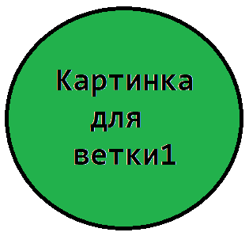
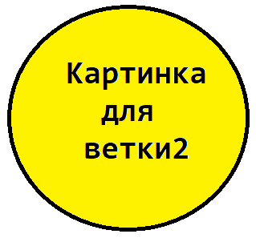
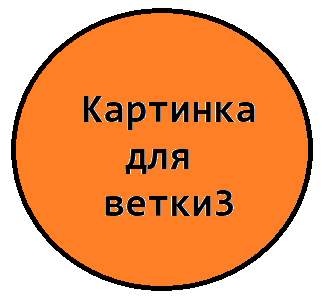
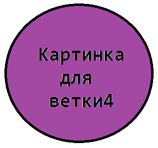

# Заголовоки
## Заголовок2
### Заголовок3

# Форматирование текста
*курсив*                _курсив_
**жирный**              __жирный__
***жирный курсив***     ___жирный курсив___
~~зачеркнутый~~

# Цитаты:
>Цитата1
>>Цитата2
>>>Цитата3

# Список нумерованный:
1. Пункт1
2. Пункт2
3. Пункт3
4. Пункт4

# Список маркированный (1 вариант):
+ Пункт1
+ Пункт2
+ Пункт3
+ Пункт4

# Список маркированный (2 вариант):
* Пункт1
* Пункт2
* Пункт3
* Пункт4

# Ссылка на сайт
[Google](https://google.com "Всплывающий текст")

# Ссылка на картинку
   

# Ссылки на картинки

